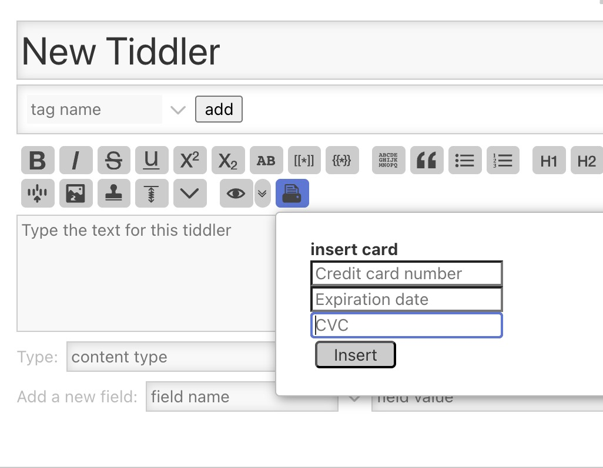
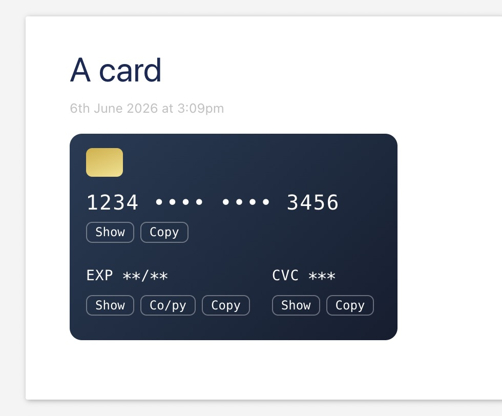

# credit-card

A TiddlyWiki plugin for managing credit card information.

## Features

- Renders a credit card-style display widget
- Masks sensitive values by default
- Lets you reveal or hide the card number, expiration date, and CVC
- Supports copying values to the clipboard
- Includes an editor toolbar button for inserting credit card content

## Screenshots

### Editing



### Rendered output



## Project structure

- `src/credit-card-render.ts` — widget source
- `src/dropdown.wiki` — toolbar dropdown UI
- `files/` — generated plugin assets
- `build-credit-card.js` — build script

## Build

```bash
npm install
npm run build
```

This generates the import file [credit-card.tid](credit-card.tid) in the repository root.

Import this file into TiddlyWiki directly.

For continuous rebuilds:

```bash
npm run watch
```

## Plugin metadata

- Plugin title: `$:/plugins/wiki-fever/credit-card`
- Core version: `>=5.0.8`
- Version: `0.0.1`
- License: MIT

## Notes

This repository contains the source and build setup for packaging the plugin into TiddlyWiki-compatible files under `files/`.

For manual installation, use [credit-card.tid](credit-card.tid) instead of importing files from [files/](files/).

The build manifest [tiddlywiki.files](tiddlywiki.files) can mark entries with `generate: "empty"` for files that should be created as empty outputs during build time.
